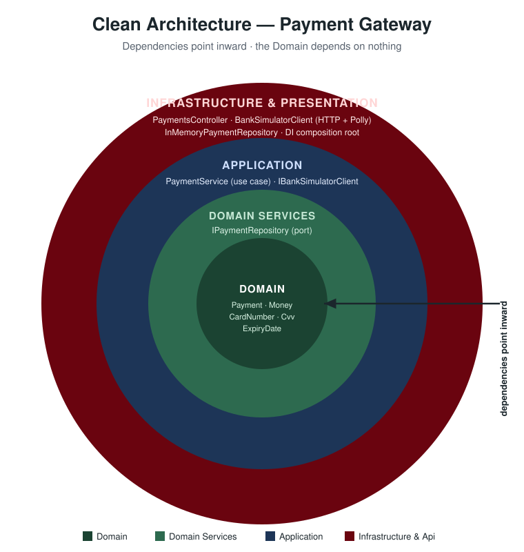

# Payment Gateway

A payment gateway REST API built in .NET 10.

## Architecture

The solution follows **Clean Architecture / DDD** principles, divided into four projects:

```
src/
  PaymentGateway.Domain          # Entities, value objects, enums, repository interfaces — no external dependencies
  PaymentGateway.Application     # Use cases (PaymentService), DTOs, service interfaces (IBankSimulatorClient)
  PaymentGateway.Infrastructure  # InMemoryPaymentRepository, BankSimulatorClient (HTTP + Polly retry)
  PaymentGateway.Api             # Controllers, request/response models, DI composition root
test/
  PaymentGateway.Api.Tests       # Unit tests (domain, application) + integration tests (WebApplicationFactory)
imposters/                       # Bank simulator configuration (Mountebank) — do not modify
docker-compose.yml               # Starts the bank simulator on localhost:8080
PaymentGateway.sln
```

### Dependency flow

All dependencies point **inward** — the Domain depends on nothing. The outer layers depend on the inner ones through interfaces, never the reverse. Api and Infrastructure form the outermost layer: the Api drives the use cases, while the Infrastructure implements the ports they define.

<p align="center">
  
</p>


## Endpoints

| Method | Route | Description |
|--------|-------|-------------|
| POST | `/api/payments` | Process a payment through the acquiring bank |
| GET | `/api/payments/{id}` | Retrieve a previously processed payment |

### POST /api/payments

Request body:
```json
{
  "cardNumber": "2222405343248877",
  "expiryMonth": 4,
  "expiryYear": 2030,
  "currency": "BRL",
  "amount": 100,
  "cvv": "123"
}
```

Response statuses:

| Status | HTTP | Description |
|--------|------|-------------|
| Authorized | 200 | Bank approved the payment |
| Declined | 200 | Bank declined the payment |
| Rejected | 422 | Request was invalid — bank was not called |
| — | 502 | Bank unavailable (card ending in 0 in simulator) |

## Running the project

Start the bank simulator:
```bash
docker-compose up -d
```

Run the API:
```bash
dotnet run --project src/PaymentGateway.Api
```

Run the tests:
```bash
dotnet test
```

## Design decisions

### Clean Architecture
The domain layer has zero external dependencies. The `Application` layer defines interfaces (`IPaymentRepository`, `IBankSimulatorClient`) that `Infrastructure` implements. This means the storage engine or the bank client can be swapped without touching domain or application logic.

### Supported currencies
USD, EUR, BRL — the spec requires validating against no more than 3 ISO codes. Validation is enforced by the `Money` value object in the domain.

### Value objects
Card number, expiry date, money and CVV are modelled as value objects with built-in validation. Any invalid input throws a `DomainException`, which the `PaymentService` catches and maps to a `Rejected` response — without calling the bank.

### Payment storage
An `InMemoryPaymentRepository` is used as the spec explicitly states that integration with a real storage engine is not required. The `IPaymentRepository` interface in the domain layer means a persistent implementation (e.g. EF Core + PostgreSQL) can be added in `Infrastructure` without touching any other layer.

### Bank simulator errors (503)
When the bank returns 503, a `BankUnavailableException` is thrown (defined in Application, thrown by Infrastructure). The controller catches it and returns **502 Bad Gateway**. The payment is not stored.

### Retry strategy (Polly)

The `BankSimulatorClient` uses a Polly `ResiliencePipeline` with exponential backoff retry (up to 3 attempts, starting at 300ms).

**Critical design decision — idempotency filter:**

Retry is applied **only** to connection-level errors where we can be certain the request never reached the bank:

| Error | `HttpRequestError` | Safe to retry? |
|---|---|---|
| Connection refused / reset | `ConnectionError` | ✅ Request never left the client |
| DNS resolution failure | `NameResolutionError` | ✅ Request never left the client |
| TLS handshake failure | `SecureConnectionError` | ✅ Request never left the client |
| 503 Service Unavailable | — (HTTP response received) | ❌ Bank may have processed the payment |
| 500 Internal Server Error | — (HTTP response received) | ❌ Bank may have processed the payment |
| Response timeout | `TaskCanceledException` | ❌ Request was sent — outcome unknown |

Retrying on any error where a response was received — or where the request was sent but no response came back — would risk **processing the same payment twice**. In a payment system, a duplicate charge is a serious incident. The conservative predicate avoids this at the cost of not retrying on transient server-side errors.

---

## Security considerations

Authentication and authorization are out of scope for this assessment, but in a production payment gateway the following would be mandatory.

### Merchant authentication (API Keys / OAuth 2.0)

Every request must be authenticated. Two common approaches:

**API Keys**
- Each merchant receives a secret key issued at onboarding
- Key is sent in the `Authorization: Bearer <key>` header
- Gateway validates the key on every request and resolves the merchant identity from it
- Keys are stored hashed (e.g. HMAC-SHA256) — the plaintext is never stored

**OAuth 2.0 Client Credentials**
- Merchant authenticates against an identity server and receives a short-lived JWT
- Gateway validates the JWT signature and expiry on every request — no roundtrip to the identity server
- Token rotation is managed by the client, reducing the blast radius of a leaked credential

### Authorization — merchants can only see their own payments

The `GET /api/payments/{id}` endpoint must verify that the authenticated merchant is the owner of the payment being retrieved. Without this, a merchant could enumerate other merchants' payment IDs and retrieve sensitive card data.

Implementation: attach `merchantId` to every `Payment` entity at creation time; the query layer filters by both `id` and the `merchantId` resolved from the authenticated principal.

### Rate limiting

Without rate limiting, a compromised merchant key can be used to enumerate card numbers, probe the bank, or generate fraudulent charges. A token-bucket or sliding-window limiter (e.g. per merchant, per IP) is the minimum acceptable control.

### Idempotency keys

A merchant retrying a failed request could unknowingly submit the same payment twice. Accepting a client-supplied `Idempotency-Key` header and caching responses by key (per merchant) for a short window prevents duplicate charges — a concern already reflected in the retry strategy for bank calls.

---

## Possible future improvements

### Circuit Breaker

Currently, if the bank is unavailable, every request retries 3 times before failing. Under sustained bank outages this creates unnecessary load and increases latency for all merchants.

A **Circuit Breaker** (also available in Polly) would complement the retry strategy:

```
Closed (normal) → [N consecutive failures] → Open (fast-fail) → [cooldown] → Half-Open → [success] → Closed
```

When the circuit is **Open**, requests fail immediately without retrying, protecting both the bank and the gateway from cascading failures.

This should be paired with **observability**:

- **Structured logs** — `paymentId`, `merchantId`, `status`, `durationMs` on every request. CVV and full PAN must never appear in logs.
- **Metrics** — `payments_processed_total{status}`, `bank_request_duration_ms` (p95/p99), `bank_unavailable_total`
- **Distributed tracing** — OpenTelemetry propagated through to the bank call, `X-Trace-Id` returned in the response for merchant support requests
- **Alerting** — circuit open, rejection rate spike, p99 > 2s, error rate > 1%

### CQRS (Command Query Responsibility Segregation)

Currently `PaymentService` handles both writes (`ProcessAsync`) and reads (`GetAsync`) against the same store. If the system needed to scale, CQRS could be introduced to segregate them:

```
Application/
  Payments/
    Commands/
      ProcessPaymentCommand.cs
      ProcessPaymentHandler.cs
    Queries/
      GetPaymentQuery.cs
      GetPaymentHandler.cs
```

This would allow, for example:
- **Separate read/write databases** — writes go to a transactional store; reads are served from a denormalised read model or cache.
- **Event sourcing** — commands produce domain events; read models are projections rebuilt from those events.
- **Independent scaling** — read-heavy traffic handled separately from payment processing.

For the current requirements (two endpoints, one in-memory store) this would be over-engineering.
